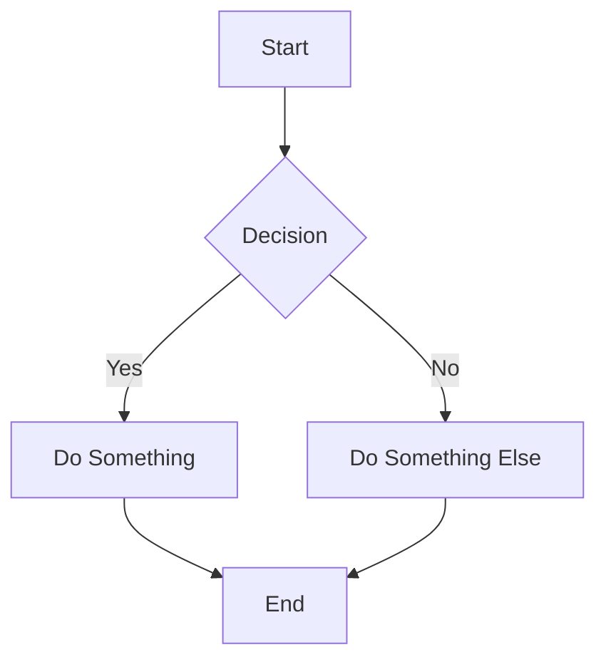
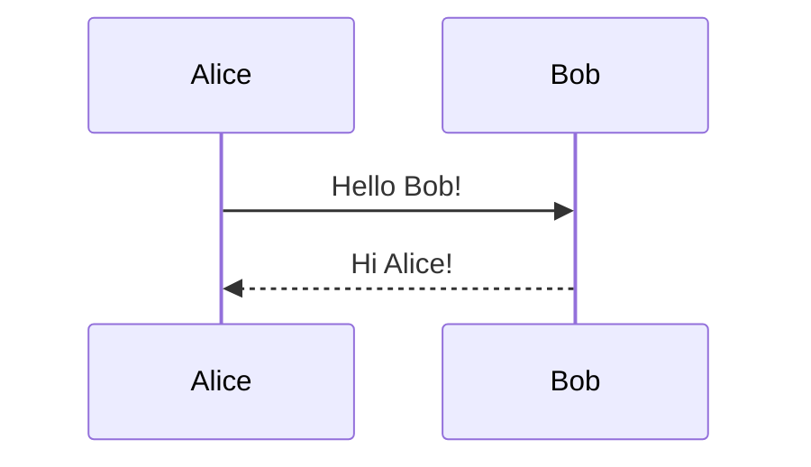
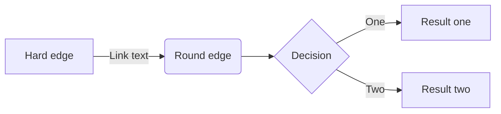
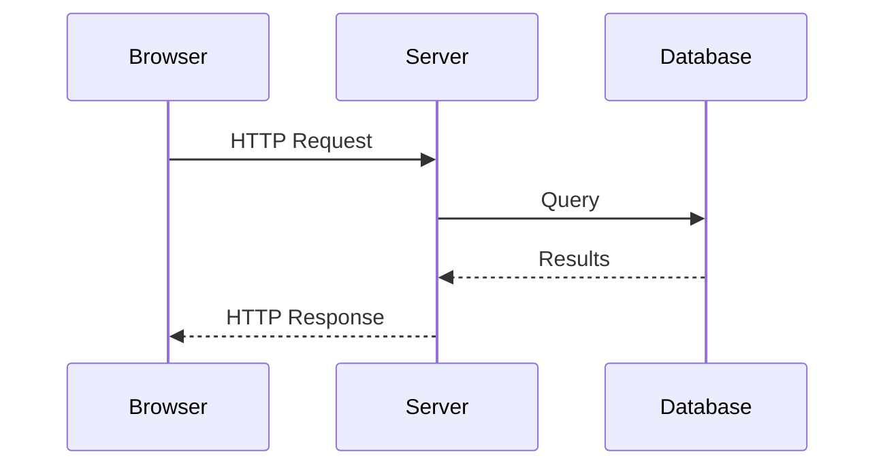
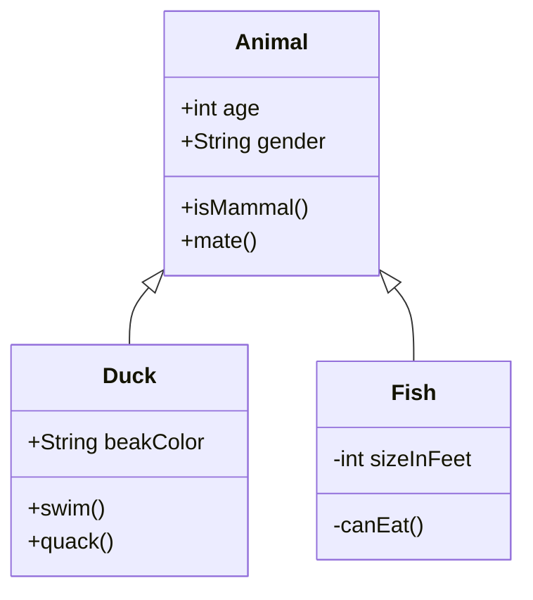
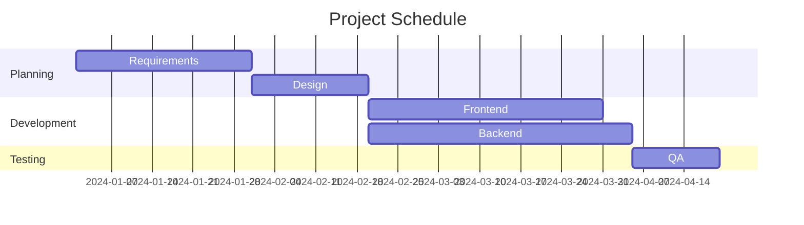
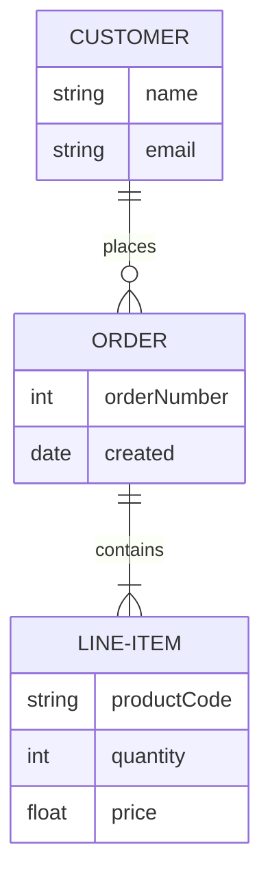
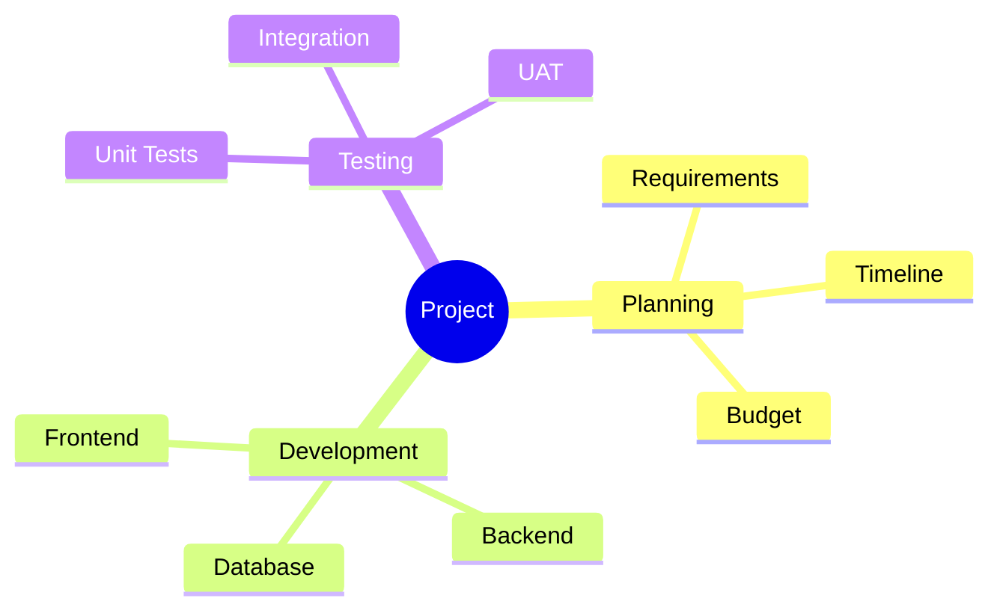
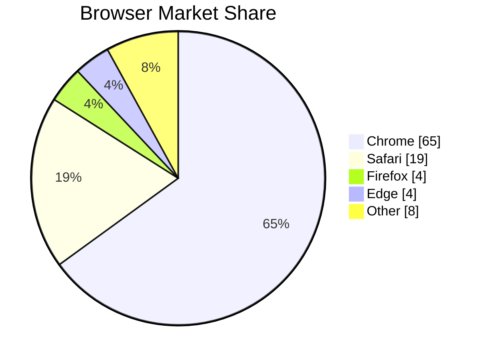
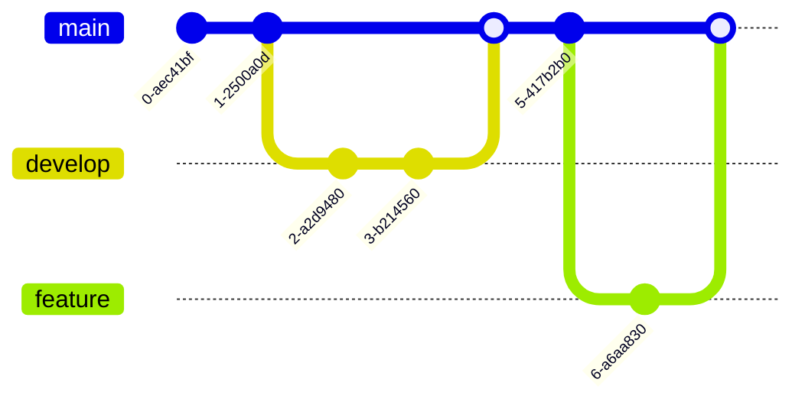

# Mermaid Diagram Generator for Inkscape

[](https://inkscape.org/)
[](https://nodejs.org/)
[](https://mermaid.js.org/)
[](LICENSE)

> **Create beautiful diagrams in Inkscape using Mermaid's simple text-based syntax**

Transform text descriptions into professional flowcharts, sequence diagrams, class diagrams, and more—directly within Inkscape. Perfect for technical documentation, presentations, and design projects.

---

## 📋 Table of Contents

- Features
- Supported Diagrams
- Requirements
- Installation
- Quick Start
- Usage Guide
- Configuration
- Examples
- Troubleshooting
- Contributing
- License

---

## ✨ Features

- **📊 Full Mermaid Support**
  - All diagram types supported
  - Native SVG output for editability
  - High-quality PNG export option

- **🎨 Rich Styling Options**
  | Feature | Description |
  |---------|-------------|
  | **Themes** | Default, Dark, Forest, Neutral, Base |
  | **Backgrounds** | White, Transparent, Custom colors |
  | **Scaling** | Manual scale factor or auto-fit |
  | **Quality** | 1x to 4x resolution for PNG |

- **📍 Smart Positioning**
  - 9 preset positions (center, corners, edges)
  - Selection-relative placement
  - Custom X/Y offsets
  - Page or viewport alignment

- **🔧 Advanced Features**
  - PDF-to-SVG pipeline for best quality
  - Embed or link external images
  - Custom config and CSS files
  - Layer management
  - Object locking
  - Metadata support (title, description)

---

## 📊 Supported Diagrams

| Diagram Type | Syntax Keyword | Description |
|--------------|----------------|-------------|
| **Flowchart** | `flowchart` or `graph` | Process flows and decision trees |
| **Sequence** | `sequenceDiagram` | Interaction between entities |
| **Class** | `classDiagram` | UML class relationships |
| **State** | `stateDiagram-v2` | State machine diagrams |
| **ER Diagram** | `erDiagram` | Entity-relationship models |
| **Gantt** | `gantt` | Project timelines |
| **Pie Chart** | `pie` | Proportional data |
| **Git Graph** | `gitGraph` | Git branch visualization |
| **Mindmap** | `mindmap` | Hierarchical ideas |
| **Timeline** | `timeline` | Chronological events |
| **User Journey** | `journey` | User experience mapping |
| **Quadrant** | `quadrantChart` | 2x2 matrix analysis |
| **Sankey** | `sankey-beta` | Flow quantities |

---

## 📦 Requirements

### Core Requirements

| Component | Version | Purpose |
|-----------|---------|---------|
| **Inkscape** | 1.0+ | Vector graphics editor |
| **Node.js** | 14+ | JavaScript runtime |
| **Mermaid CLI** | 10+ | Diagram generation |

### Optional Dependencies

| Component | Purpose |
|-----------|---------|
| **Pillow** (Python) | Automatic image dimension detection |
| **Custom CSS** | Advanced diagram styling |

---

## 🚀 Installation

### Step 1: Install Node.js

<details>
<summary><b>Windows</b></summary>

1. Download from [nodejs.org](https://nodejs.org/)
2. Run installer, accept defaults
3. Verify installation:
   ```cmd
   node --version
   npm --version
   ```

</details>

<details>
<summary><b>macOS</b></summary>

```bash
# Using Homebrew
brew install node

# Or download from nodejs.org
```

</details>

<details>
<summary><b>Linux</b></summary>

```bash
# Ubuntu/Debian
sudo apt update
sudo apt install nodejs npm

# Fedora
sudo dnf install nodejs npm

# Arch
sudo pacman -S nodejs npm
```

</details>

### Step 2: Install Mermaid CLI

```bash
npm install -g @mermaid-js/mermaid-cli
```

**Verify installation:**

```bash
mmdc --version
# Should output: x.x.x (e.g., 10.6.1)
```

> ⚠️ **Windows Users**: Note the full path to `mmdc.cmd`:
> ```
> C:\Users\[YourName]\AppData\Roaming\npm\mmdc.cmd
> ```

### Step 3: Install the Extension

**Locate your Inkscape extensions directory:**

| OS | Path |
|----|------|
| **Windows** | `C:\Users\[YourName]\AppData\Roaming\inkscape\extensions\` |
| **macOS** | `~/Library/Application Support/org.inkscape.Inkscape/config/inkscape/extensions/` |
| **Linux** | `~/.config/inkscape/extensions/` |

> 💡 **Tip:** In Inkscape: **Edit → Preferences → System** shows extensions path

**Install files:**

1. **Create extension folder:**
   ```bash
   mkdir -p [extensions-directory]/mermaid_ink
   ```

2. **Copy files:**
   ```bash
   cp mermaid_diagram.py [extensions-directory]/mermaid_ink/
   cp mermaid_diagram.inx [extensions-directory]/mermaid_ink/
   ```

3. **Set permissions** (Linux/macOS):
   ```bash
   chmod +x [extensions-directory]/mermaid_ink/mermaid_diagram.py
   ```

4. **Restart Inkscape**

### Step 4: Verify Installation

1. Open Inkscape
2. Navigate to **Extensions → Render → Mermaid Diagram**
3. Extension dialog should appear

---

## 🎯 Quick Start

### Create Your First Diagram

1. Open Inkscape
2. Go to **Extensions → Render → Mermaid Diagram**
3. In the **Diagram** tab, enter:



4. Click **Apply**

Your flowchart appears in the document, fully editable as SVG!

---

## 📖 Usage Guide

### Tab Overview

| Tab | Purpose |
|-----|---------|
| **Diagram** | Enter Mermaid code or load from file |
| **Style** | Theme, background, dimensions |
| **Format** | Output format, scale, quality |
| **Position** | Placement and alignment options |
| **Scale** | Auto-scaling and size limits |
| **Config** | CLI path, config files |
| **Advanced** | Timeout, viewport, temp files |
| **Layer** | Layer management, object properties |

### Input Methods

#### Direct Code Entry

Enter Mermaid syntax directly in the code field:



#### Load from File

1. Check **"Use external file"**
2. Enter path to `.mmd` or `.mermaid` file
3. Click **Apply**

### Output Formats

| Format | Best For | Editable |
|--------|----------|----------|
| **SVG** | Editing, scalability | ✅ Yes |
| **PNG** | Presentations, sharing | ❌ No |

### Theme Options

| Theme | Description |
|-------|-------------|
| `default` | Standard Mermaid colors |
| `dark` | Dark background, light elements |
| `forest` | Green nature palette |
| `neutral` | Grayscale, professional |
| `base` | Minimal, for custom CSS |

### Position Modes

```
┌─────────────────────────────────────┐
│ top_left    top_center    top_right │
│                                     │
│ middle_left   center   middle_right │
│                                     │
│ bottom_left bottom_center bottom_right │
└─────────────────────────────────────┘
```

**Special modes:**
- **cursor**: Place at current view center
- **Use selection bbox**: Position relative to selected object

---

## ⚙️ Configuration

### Style Tab

| Option | Description | Default |
|--------|-------------|---------|
| **Theme** | Color scheme | default |
| **Background** | Background color | white |
| **Width** | Diagram width (px) | 800 |
| **Height** | Diagram height (px) | 600 |

### Format Tab

| Option | Description | Default |
|--------|-------------|---------|
| **Output Format** | SVG or PNG | SVG |
| **Scale Factor** | Size multiplier | 1.0 |
| **Quality** | PNG resolution (1-4x) | 2 |
| **Embed Image** | Embed or link PNG | ✓ |

### Scale Tab

| Option | Description | Default |
|--------|-------------|---------|
| **Auto Scale** | Fit to max dimensions | ✗ |
| **Max Width** | Maximum width (0=none) | 0 |
| **Max Height** | Maximum height (0=none) | 0 |
| **Maintain Aspect Ratio** | Keep proportions | ✓ |
| **Lock Object** | Prevent edits | ✗ |

### Config Tab

| Option | Description | Default |
|--------|-------------|---------|
| **Mermaid CLI Path** | Path to mmdc | mmdc |
| **Config File** | Custom mermaidConfig.json | (empty) |
| **CSS File** | Custom stylesheet | (empty) |
| **Inkscape Path** | Path to Inkscape CLI | inkscape |

### Advanced Tab

| Option | Description | Default |
|--------|-------------|---------|
| **Timeout** | Generation timeout (sec) | 30 |
| **Viewport Width** | Puppeteer viewport | 1920 |
| **Viewport Height** | Puppeteer viewport | 1080 |
| **Keep Temp Files** | Don't delete temp files | ✗ |
| **Quiet Mode** | Suppress debug output | ✓ |
| **Fit to Content** | Crop empty space | ✓ |

### Layer Tab

| Option | Description | Default |
|--------|-------------|---------|
| **Create Layer** | New layer for diagram | ✗ |
| **Layer Name** | Name for new layer | Mermaid Diagrams |
| **Object ID** | Custom SVG ID | (auto) |
| **Add Title** | Include title element | ✗ |
| **Add Description** | Include desc element | ✗ |

---

## 💡 Examples

### Example 1: Flowchart



### Example 2: Sequence Diagram



### Example 3: Class Diagram



### Example 4: Gantt Chart



### Example 5: Entity Relationship



### Example 6: Mindmap



### Example 7: Pie Chart



### Example 8: Git Graph



---

## 🐛 Troubleshooting

### Common Issues

<details>
<summary><b>Extension not appearing in menu</b></summary>

**Solutions:**
1. Verify files are correctly placed:
   ```bash
   ls [extensions-directory]/mermaid_ink/
   # Should show: mermaid_diagram.py, mermaid_diagram.inx
   ```
2. Check file permissions
3. Restart Inkscape completely
4. Check Inkscape error log: **Edit → Preferences → System → Open Error Log**

</details>

<details>
<summary><b>Mermaid CLI not found</b></summary>

**Error:** `Mermaid CLI not found at: mmdc`

**Solutions:**
1. Verify mmdc is installed:
   ```bash
   mmdc --version
   ```
2. Install if missing:
   ```bash
   npm install -g @mermaid-js/mermaid-cli
   ```
3. **Windows**: Use full path in Config tab:
   ```
   C:\Users\[YourName]\AppData\Roaming\npm\mmdc.cmd
   ```
4. **Linux/macOS**: Find path:
   ```bash
   which mmdc
   # Use this path in Config tab
   ```

</details>

<details>
<summary><b>Diagram syntax error</b></summary>

**Error:** `Mermaid CLI error: Parse error...`

**Solutions:**
1. Validate syntax at [mermaid.live](https://mermaid.live/)
2. Check for:
   - Missing diagram type declaration
   - Unclosed brackets
   - Invalid characters
   - Incorrect indentation
3. Start with a simple example and build up

</details>

<details>
<summary><b>Puppeteer/Chrome errors</b></summary>

**Error:** `Could not find Chrome...` or `Puppeteer timeout`

**Solutions:**
1. Install Chrome/Chromium:
   ```bash
   # Windows: Install Chrome normally
   # Linux:
   sudo apt install chromium-browser
   ```
2. Increase timeout in Advanced tab
3. Check system resources (RAM, CPU)

</details>

<details>
<summary><b>PDF conversion fails</b></summary>

**Error:** `Inkscape conversion error...`

**Solutions:**
1. Verify Inkscape CLI works:
   ```bash
   inkscape --version
   ```
2. Update Inkscape path in Config tab
3. **Windows**: Use full path:
   ```
   C:\Program Files\Inkscape\bin\inkscape.exe
   ```
4. Enable **pdf-poppler** option for better compatibility

</details>

<details>
<summary><b>Empty or corrupted output</b></summary>

**Solutions:**
1. Disable **Quiet Mode** to see debug output
2. Enable **Keep Temp Files** and check generated files
3. Try PNG format instead of SVG
4. Reduce diagram complexity
5. Check available disk space

</details>

<details>
<summary><b>Diagram appears but not editable (SVG)</b></summary>

**Solutions:**
1. Ungroup the imported diagram (Ctrl+Shift+G)
2. Check if object is locked (unlock in Object Properties)
3. Ensure "Output Format" is set to SVG, not PNG

</details>

### Debug Mode

Enable detailed output for troubleshooting:

1. Uncheck **Quiet Mode** in Advanced tab
2. Check **Keep Temp Files**
3. Run Inkscape from terminal to see console output:
   ```bash
   inkscape
   ```
4. Temp files location:
   - Check the path in extension output
   - Or set custom path in **Temp Directory** field

### Checking Temp Files

With **Keep Temp Files** enabled:

| File | Purpose |
|------|---------|
| `diagram.mmd` | Input Mermaid code |
| `diagram.pdf` | Generated PDF |
| `diagram_converted.svg` | Converted SVG |
| `diagram_converted.png` | Converted PNG |

---

## 📁 File Structure

```
mermaid_ink/
├── mermaid_diagram.py      # Main extension code
├── mermaid_diagram.inx     # Inkscape extension definition
├── README.md               # This file
└── examples/               # Example diagrams (optional)
    ├── flowchart.mmd
    ├── sequence.mmd
    └── class.mmd
```

---

## 🔧 Custom Configuration

### Mermaid Config File

Create a JSON config file for advanced customization:

```json
{
  "theme": "base",
  "themeVariables": {
    "primaryColor": "#4a90d9",
    "primaryTextColor": "#fff",
    "primaryBorderColor": "#2c5aa0",
    "lineColor": "#333",
    "secondaryColor": "#006100",
    "tertiaryColor": "#fff"
  },
  "flowchart": {
    "curve": "basis",
    "padding": 20
  },
  "sequence": {
    "diagramMarginX": 50,
    "diagramMarginY": 10,
    "actorMargin": 50,
    "width": 150,
    "height": 65
  }
}
```

Save as `mermaid-config.json` and reference in Config tab.

### Custom CSS

Create a CSS file for diagram styling:

```css
.node rect {
  fill: #f0f0f0;
  stroke: #333;
  stroke-width: 2px;
}

.edgePath .path {
  stroke: #666;
  stroke-width: 2px;
}

.label {
  font-family: 'Arial', sans-serif;
  font-size: 14px;
}
```

Save as `mermaid-styles.css` and reference in Config tab.

---

## 📚 Resources

- **Mermaid Documentation**: [mermaid.js.org/intro/](https://mermaid.js.org/intro/)
- **Live Editor**: [mermaid.live](https://mermaid.live/)
- **Mermaid CLI**: [github.com/mermaid-js/mermaid-cli](https://github.com/mermaid-js/mermaid-cli)
- **Inkscape Extensions**: [inkscape.gitlab.io/extensions/documentation/](https://inkscape.gitlab.io/extensions/documentation/)

---

## 🤝 Contributing

Contributions are welcome!

1. Fork the repository
2. Create a feature branch (`git checkout -b feature/new-feature`)
3. Commit changes (`git commit -m 'Add new feature'`)
4. Push to branch (`git push origin feature/new-feature`)
5. Open a Pull Request

**Development Setup:**
```bash
git clone https://github.com/YouvenZ/mermaid_ink.git
cd mermaid_ink
# Symlink for testing
ln -s $(pwd) ~/.config/inkscape/extensions/mermaid_ink
```

---

## 📄 License

This project is licensed under the MIT License - see LICENSE file for details.

---

## 📧 Support

- **Issues**: [GitHub Issues](https://github.com/YouvenZ/mermaid_ink/issues)
- **Discussions**: [GitHub Discussions](https://github.com/YouvenZ/mermaid_ink/discussions)

---

## 🙏 Acknowledgments

- [Mermaid.js](https://mermaid.js.org/) - The diagram rendering engine
- [Inkscape](https://inkscape.org/) - Open source vector graphics
- [Node.js](https://nodejs.org/) - JavaScript runtime

---

## 🔄 Changelog

### v1.0.0 (2024)
- ✨ Initial release
- ✅ All Mermaid diagram types
- ✅ SVG and PNG output
- ✅ PDF-to-SVG conversion pipeline
- ✅ 5 built-in themes
- ✅ Auto-scaling
- ✅ Layer management
- ✅ Custom config/CSS support
- ✅ Position and alignment options